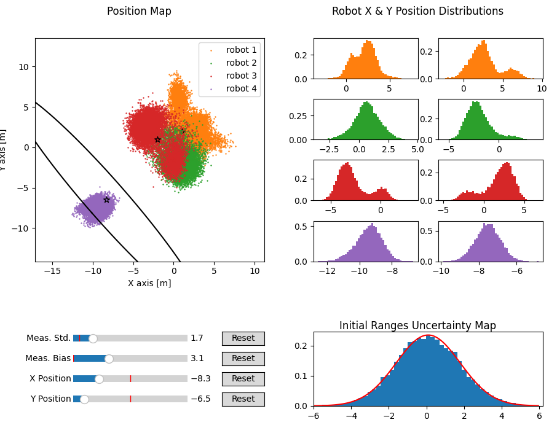

# MDS Uncertainty

This repository contains tools for exploring the position uncertainty
that exists when using Multidimensional Scaling (MDS) for localization.

The report on the effort to quantify MDS uncertainty can be found [here](docs/mds_uncertainty.pdf)
in the ``docs`` directory.

To learn more about Multidimensional Scaling, please refer to
[\[1\]](https://ieeexplore.ieee.org/document/7298562/).

  <em>example plot from the mds gui</em>
 

## Installation
Install python package dependencies from the ``requirements.txt`` file.

Installation instructions for pytorch can be found [here](https://pytorch.org/get-started/locally/).

## Running the MDS Uncertainty GUI

The MDS Uncertainty GUI can be run with: ``python3 simulate_mds.py``.

In the plotted scenario, ranging measurements are being exchanged
between all four robots marked with stars. The range measurements are
then input into the multidimensional scaling algorithm and then
Procrustes anlaysis (also mentioned in [1]) is used to align the MDS
result with the true point positions.

### Slider Functions
The ``Meas. Std.`` slider increase the standard deviation of all ranging measurements.  
The ``Meas. Bias`` slider increases the measurement bias for all
ranging measurements.  
The ``X Position`` slider moves the X position of the fourth purple robot.  
The ``Y Position`` slider moves the Y position of the fourth purple robot.

### Plot Descriptions
The bottom right graph shows the distribution of bias/noise added to the
ranging measurements.  
The top right plots show the distributions of the final estimated X and
Y positions for each robot.  
The left plot shows a top-down view of the estimated X-Y positions
of each robot with the 95% confidence interval of the Cramer Rao Lower
Bound ellipse plotted as the black ellipse and centered at the true
robot's position.  

## Troubleshooting
If plotting is too slow when moving sliders, you can decrease the ``k``
variable near the top of ``simulate_mds.py`` ([here](https://github.com/betaBison/mds-uncertainty-private/blob/main/simulate_mds.py#L28)) to decrease the number of samples that are plotted.

## References
[1] Dokmanic, R. Parhizkar, J. Ranieri, and M. Vetterli, “Euclidean
Distance Matrices: Essential theory, algorithms, and
applications,”IEEE Signal Processing Magazine, vol. 32, no. 6,
pp. 12–30, nov 2015.
